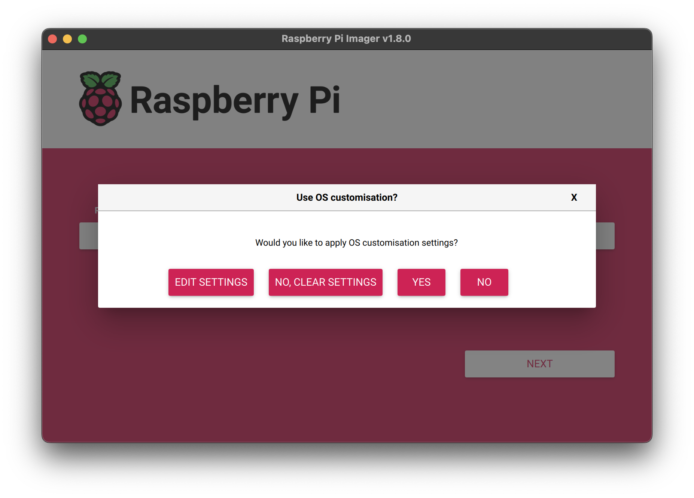

# How to control your home heating

I needed a solution to control my home heating. I wanted a browser-based solution, so that everyone with a browser-capable device on my home LAN could control the heating.

This means that I need a web server running somewhere, and the web server should take commands over http and turn on/off the required equipment.

The equipment that needs to be controlled is the following:

* The _boiler_. The boiler burns fuel to warm up water to a preset temperature.
* The _Underfloor pump_. The underfloor pump pumps hot water to the water circuit running under my house's floor. When the water is warm, this will also warm up my house's floor, and in turn my house.
* The _Towel rail pump_. The towel rail is on a separate water circuit than the underfloor, so it requires a separate pump.

Each of the above equipment is connected to a separate relay that provides electrical power each of them. These relays provide 240V AC. The control voltage for those relays is also 240 V.

To solve this problem, I connected a Raspberry Pi 4 to a Seeed studios [Grove - 4-Channel SPDT Relay](https://wiki.seeedstudio.com/Grove-4-Channel_SPDT_Relay/).

The physical connections are shown below:

The relays are:

* Legrand 4 125 44
  * 25A 2 Pole Power Contactor 2 N/O with 230V AC Coil and Handle
  * 230V ac control,
  * 2 Normally Open contacts
  * 17.8mm wide
  * ~ 50€

I also attached an auxiliary contact to the relays:

* Legrand 4 124 29
  * 9mm wide
  * ~ 70€
  
I will use the auxiliary contacts in the future to read the state of the relays,

I could not connect the Raspberry Pi to my home WiFi for two reasons:

* I installed the Raspberry Pi in a metal case. The Raspberry Pi will be near a lot of mechanical equipment (burner, pumps, water pipes, valves, etc), and near an electrical installation. TO protect the Raspberry Pi from any mechanical strains and EMI, I decided to install it within a metal case. The metal case essentially rendered the WiFi module of the Raspberry Pi useless. I could not find a simple way of installing an external antenna to the Raspberry Pi, so I abandoned this idea.
* The mechanical installation room (where the burner and pumps are installed) is not close to my apartment where the Ubiquiti access point is installed. In particular, there is concrete around the mechanical room and no line of sight with the apartment's access point.

I also could not connect the Raspberry Pi to my home's wired infrastructure because the mechanical installation room does not have a wiring installation (piping) to my apartment. There is currently some piping dedicated to wiring but it does not end up close to my wired Ethernet infrastructure, and it also goes through a hidden (as in within a wall) junction box. So I could not use the currently existing wire piping.

The 4-channel SPDT Relay communicates over I2C.

I used pins 3-6 of the 40-pin GPIO of the Raspberry Pi:

# Logical structure

Once the physical connections were up and running, I had to deploy a web werver on the Raspberry Pi to expose controls for the three relays.

The logical structure is shown below:

The above diagram shows the interaction of the three processes that make up this solution.

1. At first, the web browser from the user's device requests the default page from the server.
2. This request gets handled by the NGINX web server running on the Raspberry Pi.
3. When requesting the root of the web server, NGINX simply delivers three static files:

* index.html
* page.js
* styles.css

4. The static web page that NGINX serves runs some JavaScript functions whenever the page loads and whenever the user clicks on the equipment controls. Most of the time, the JavaScript functions call some REST API endpoints on the web server.
5. Once the NGINX web server receives these requests on the REST API endpoints, it forwards them to the GUnicorn WSGI.
6. Upon receiving API requests, GUnicorn runs a Python Flask application. In particular, it calls particular functions associated with the particular API calls. These Python functions communicate with the 4-Channel SPDT Relay board and close/open the relays, as required. After acting on the relays, the Python function returns the state of the relays, in JSON format.
7. The NGINX seb server relays this JSON object back to the web browser, as a reply to the original REST API call.
8. When the JavaScript function running in the web browser receives the JSON reply from the API, it updates the page's DOM with the received information.

# IP plan

So, I decided to use the MikroTik SXTsq 5 ac AP to bridge the Raspberry Pi. The SXTsq 5 ac does not support bridging its eth1 interface to the wifi1 interface. As a result, I had to create a separate subnet behind the SXTsq 5 ac.

Lastly, I had to create a NAT rule to translate the 192.168.1.9 to 192.168.2.2.

# Raspberry Pi configuration

First off, I installed the official Raspberry Pi OS using the Raspberry Imager, as described in [Install using Imager](https://www.raspberrypi.com/documentation/computers/getting-started.html#raspberry-pi-imager).

Briefly:

1. you need to download the _installer_ on a computer,
2. insert an SD-card onto the computer,
3. and then write the OS installer image onto this SD Card.

After selecting the SD card during the installation process, the Imager will ask you if you want to customize the installation.

At this point, you should click on _EDIT SETTINGS_ and under _SERVICES_ enable SSH. You will need SSH to manage the Raspberry Pi server.

## Raspberry Pi network configuration

The command to statically configure the 192.168.2.2/24 IP address on the Raspberry Pi is:

~~~~~~~~
sudo nmcli con add con-name eth0mechRoom ifname eth0 type ethernet \
                             ip4 192.168.2.2/24 gw4 192.168.2.1 ipv4.dns 1.1.1.1
~~~~~~~~

I guess there is a way to apply this connection profile to the eth0 interface (using the `nmcli con up eth0mechRoom` command). Alternatively, you can restart the Raspberry Pi with the `sudo shutdown -r now`.

# Mikrotik SXTsq 5 ac configuration

You need a Windows computer with WinBox (a Mikrotik piece of software) to manage and configure the SXTsq 5 ac. In the end, the configuration looked like the following:

~~~~~~~~
/interface wifi channel
add band=5ghz-ac disabled=no name=muffins-channel width=20/40/80/160mhz
/interface wifi configuration
add country=Cyprus disabled=no mode=station name=cfg1 ssid=muffins5G
/interface wifi security
add authentication-types=wpa3-psk disabled=no name=sec-muffins5G
/interface wifi
set [ find default-name=wifi1 ] configuration=cfg1 disabled=no security=sec-muffins5G

/ip address
add address=192.168.2.1/24 interface=ether1 network=192.168.2.0
add address=192.168.1.8/24 interface=wifi1 network=192.168.1.0
add address=192.168.1.9/24 interface=wifi1 network=192.168.1.0

/ip dns
set servers=1.1.1.1,8.8.8.8

/ip firewall nat
add action=src-nat chain=srcnat in-interface=ether1 out-interface=wifi1 \
                                src-address=192.168.2.2 to-addresses=192.168.1.9
add action=dst-nat chain=dstnat dst-address=192.168.1.9 in-interface=wifi1 \
                                                        to-addresses=192.168.2.2

/ip route
add disabled=no distance=1 dst-address=0.0.0.0/0 gateway=192.168.1.1 \
              routing-table=main scope=30 suppress-hw-offload=no target-scope=10

/system clock
set time-zone-name=Asia/Nicosia

/system ntp client
set enabled=yes
/system ntp client servers
add address=2.cy.pool.ntp.org
add address=0.europe.pool.ntp.org
~~~~~~~~
